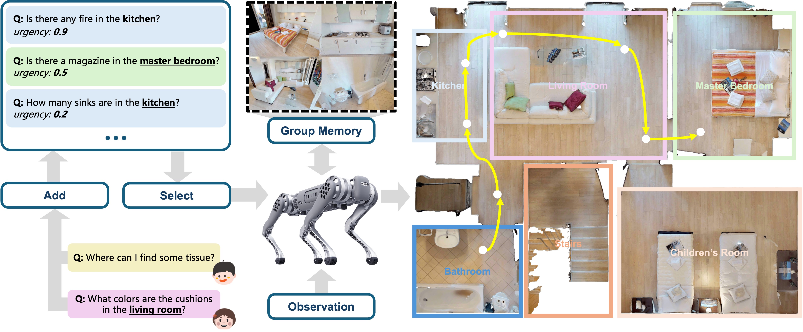
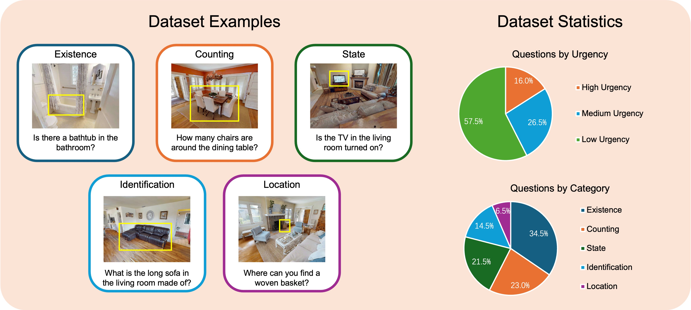

# ParaEQsA: Parallel and Asynchronous Embodied Questions Scheduling and Answering

Official implementation of the paper **"ParaEQsA: Parallel and Asynchronous Embodied Questions Scheduling and Answering"**.



This paper formulates the **Embodied Questions Answering (EQsA)** problem, introduces a corresponding benchmark, and proposes a system to tackle the problem. Classical Embodied Question Answering (EQA) is typically formulated as answering *one single* question by actively exploring a 3D environment. Real deployments, however, often demand handling *multiple* questions that may arrive asynchronously and carry different urgencies. We formalize this setting as **E**mbodied **Q**uestion**s** **A**nswering (EQsA) and present **ParaEQsA**, a framework for *parallel, urgency-aware* scheduling and answering. ParaEQsA leverages a group memory module shared among questions to reduce redundant exploration, and a priority-planning module to dynamically schedule questions. To evaluate this setting, we contribute the **P**arallel **A**synchronous **E**mbodied **Q**uestion**s** (PAEQs) benchmark containing 40 indoor scenes and five questions per scene (200 in total), containing asynchronous follow-up questions and urgency labels. We further propose metrics for EQsA performance: **D**irect **A**nswer **R**ate (DAR), and **N**ormalized **U**rgency-**W**eighted **L**atency (NUWL), which jointly measure efficiency and responsiveness of this system. ParaEQsA consistently outperforms strong sequential baselines adapted from recent EQA systems, while reducing exploration and delay. Empirical evaluations investigate the relative contributions of priority, urgency modeling, spatial scope, reward estimation, and dependency reasoning within our framework. Together, these results demonstrate that urgency-aware, parallel scheduling is key to making embodied agents responsive and efficient under realistic, multi-question workloads.

## Installation

- Initialize `conda` environment (Linux):

```bash
conda create -n para-eqa python=3.9 -y
conda activate para-eqa
```

- Install the latest version of [Habitat-Sim](https://github.com/facebookresearch/habitat-sim) (headless with no Bullet physics) with:

``` bash
conda install habitat-sim headless -c conda-forge -c aihabitat
```

- Install [PyTorch](https://pytorch.org) that suits your machine. This project has been tested on version `2.2.1`.

```bash
pip install torch==2.2.1 torchvision==0.17.1 torchaudio==2.2.1 --index-url https://download.pytorch.org/whl/cu118
```

- Install dependencies using `pip`:

```bash
pip install -r requirements.txt
```

- Install [faiss-gpu](https://github.com/facebookresearch/faiss)

```bash
conda install -c conda-forge faiss-gpu
```

- Prepare Redis using Docker:

```bash
docker run -d --name para-eqa-redis -p 6379:6379 redis:latest
```

## Dataset



The PAEQs dataset is constructed using 40 high-quality, photo-realistic residential scenes selected from the [Habitat-Matterport 3D (HM3D)](https://aihabitat.org/datasets/hm3d-semantics/) Research Dataset. For each scene, we prepare a set of 5 questions, which are partitioned into two types: 3 initial questions presented at the start of a scenario, and 2 follow-up questions, each with a 120-second delay after the previous question has been sent. To ensure a fair and unbiased evaluation, the five questions for each scene are randomly assigned to the initial or follow-up category, ensuring each question has an equal probability of serving in either role. All 200 questions in PAEQs dataset were manually authored and refined through multiple rounds of review to ensure clarity, relevance, and correctness. The corresponding ground-truth answers were also meticulously verified. A key feature of the PAEQs dataset is the `urgency` field associated with each question. This score, a float value between 0 and 1, was systematically generated for each question using the open-source `gpt-oss-20b`. To ensure deterministic and consistent outputs, we employed a few-shot prompting strategy with the model's temperature set to 0.

The PAEQs dataset can be found in `data/benchmark`. The [HM3D](https://aihabitat.org/datasets/hm3d-semantics/) dataset should be downloaded and put in `data/HM3d`.

## Usage

### Start Redis service

```bash
docker start para-eqa-redis
```

### Run Baselines

```bash
# Memory EQA
python run_para_eqa.py -c config/memory_eqa.yaml

# Explore EQA
python run_para_eqa.py -c config/explore_eqa.yaml
```

### Run ParaEQsA

```bash
python run_para_eqa.py -c config/para_eqa.yaml
```

### Run Ablation Study

```bash
# w/o priority
python run_para_eqa.py -c config/no_priority.yaml

# w/o urgency
python run_para_eqa.py -c config/no_urgency.yaml

# w/o scope
python run_para_eqa.py -c config/no_scope.yaml

# w/o reward
python run_para_eqa.py -c config/no_reward.yaml

# w/o dependency
python run_para_eqa.py -c config/no_dependency.yaml
```
