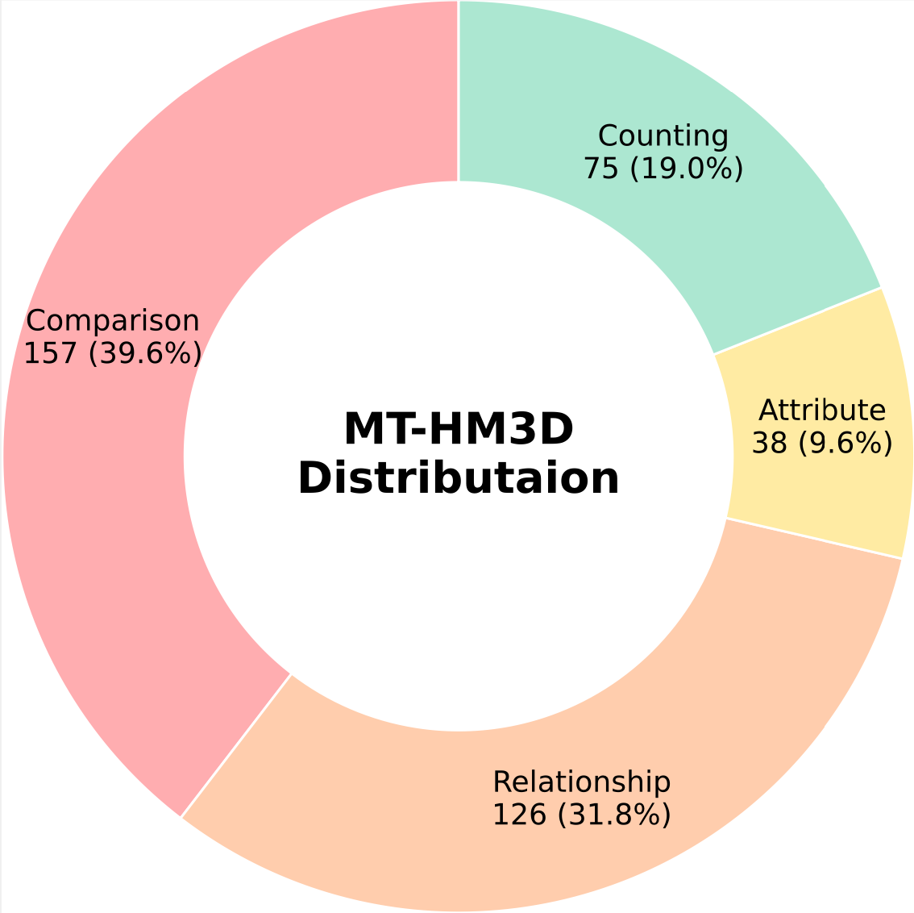

# Memory Embodied Question Answering

## Installation
Set up the conda environment (Linux, Python 3.9):
```
conda env create -f environment.yml
conda activate explore-eqa
pip install -e .
```

Install the latest version of [Habitat-Sim](https://github.com/facebookresearch/habitat-sim) (headless with no Bullet physics) with:
```
conda install habitat-sim headless -c conda-forge -c aihabitat
```

Install [flash-attention2](https://github.com/Dao-AILab/flash-attention):
```
pip install flash-attn --no-build-isolation
```

Install [faiss-gpu](https://github.com/facebookresearch/faiss)
```
conda install -c conda-forge faiss-gpu
```

Install transformers for qwenvl
```
pip install git+https://github.com/huggingface/transformers
pip install qwen-vl-utils
```

Install [AutoGPTQ](https://github.com/AutoGPTQ/AutoGPTQ)
```
git clone https://github.com/PanQiWei/AutoGPTQ.git && cd AutoGPTQ
pip install -vvv --no-build-isolation -e .
```

## Dataset


- Huggingface: [link](https://huggingface.co/datasets/zmling/MT-HM3D)
- Baidu Cloud: coming soon
- Google Drive: coming soon

Download MT-HM3D, and file structure is as follow:
```
MemoryEQA
└─ data
    └─ MT-HM3D
```

## Inference on MT-HM3D
```
sh scripts/run_memory_eqa.sh
```

## Acknowledgements

Our project is built upon [MemoryEQA](https://github.com/memory-eqa/MemoryEQA) and [Explore-EQA](https://github.com/Stanford-ILIAD/explore-eqa).
